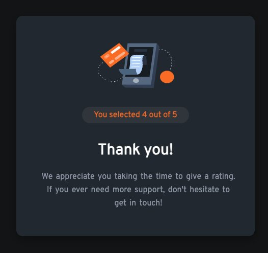

# Interactive Rating Component

## Table of contents

- [Overview](#overview)
  - [Description and Features](#description-and-features)
  - [Screenshot](#screenshot)
  - [Live App](#link)
  - [Built with](#builtWith)
  - [Author](#author)

## OverView

---

### Description and Features

User should be able to:

- View optimal layout for the app depending on their device’s screen dimension.

- See hover state when the cursor hovers over the rating numbers and the submit button.

- Select and submit a number rating.

- When rating is selected and submit is clicked, a thank you card state appears and the users rating.

---

### Screenshot and Wire Frame

---

### Live App

- Live Site URL: ()
